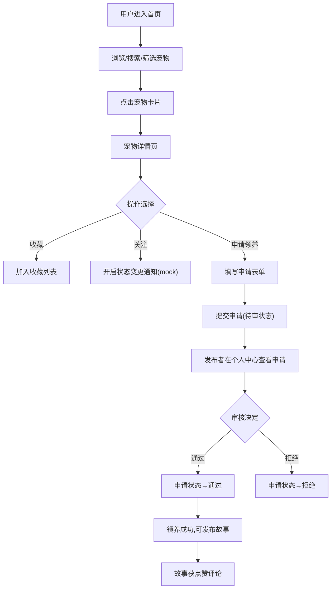

## 1. 产品概述
宠物领养信息管理平台，连接待领养宠物与爱心人士，提供宠物信息发布、搜索筛选、领养申请、故事分享等一站式服务。
- 主要解决宠物领养信息分散、流程不规范的问题，面向宠物救助者、领养申请人及平台管理员
- 通过透明化流程和社区化运营提升领养成功率，打造有温度的宠物领养社区

## 2. 核心功能

### 2.1 用户角色
| 角色 | 注册方式 | 核心权限 |
|------|---------|---------|
| 普通用户 | 模拟登录 | 浏览宠物、搜索筛选、收藏关注、提交领养申请、发布领养故事 |
| 发布者 | 模拟登录 | 发布宠物信息、查看/处理领养申请、管理自己发布的宠物 |
| 管理员 | 模拟登录 | 查看数据统计仪表盘、管理平台内容 |

### 2.2 功能模块
1. **首页**: 精选领养故事轮播、标签云、搜索筛选栏、瀑布流宠物卡片、排序功能
2. **宠物详情页**: 照片轮播、宠物完整信息、收藏/关注按钮、领养申请表单、相关推荐
3. **发布宠物页**: 宠物信息表单（名称、物种、品种、年龄、性别、体重、绝育、健康、性格标签、照片）
4. **个人中心**: 收藏列表、浏览历史、我的发布、我的申请、领养故事管理
5. **领养申请管理**: 申请列表、申请详情、接受/拒绝操作、申请状态追踪
6. **管理后台**: 数据统计仪表盘（物种饼图、趋势折线图、热门品种柱状图、成功率统计）
7. **领养故事**: 故事列表、故事详情（图文）、点赞、评论、首页精选轮播

### 2.3 页面详情
| 页面名称 | 模块名称 | 功能描述 |
|---------|---------|-----------|
| 首页 | 轮播区 | 自动切换精选领养故事，点击进入故事详情 |
| 首页 | 搜索筛选栏 | 关键词搜索（名称/描述）、物种筛选、品种筛选、年龄范围、性别、是否绝育、标签云 |
| 首页 | 排序控制 | 按发布时间降序、按关注度降序 |
| 首页 | 瀑布流卡片 | 宠物照片、名称、物种标签、年龄、性别图标、收藏数、发布时间 |
| 宠物详情页 | 照片轮播 | 多图切换、放大预览 |
| 宠物详情页 | 信息面板 | 完整宠物档案、性格标签、健康描述 |
| 宠物详情页 | 操作区 | 收藏、关注、立即申请领养 |
| 宠物详情页 | 申请表单 | 联系方式、居住环境、养宠经验、陪伴时间、家庭成员 |
| 个人中心 | 收藏列表 | 已收藏宠物卡片、取消收藏 |
| 个人中心 | 浏览历史 | 最近浏览宠物（按时间倒序） |
| 个人中心 | 我的发布 | 已发布宠物列表、查看申请数、编辑/下架 |
| 个人中心 | 我的申请 | 申请状态追踪（待审/通过/拒绝） |
| 管理后台 | 物种分布 | 饼图展示各物种宠物数量占比 |
| 管理后台 | 领养趋势 | 折线图展示每月新增/被领养数量 |
| 管理后台 | 热门品种 | TOP10 柱状图展示热门品种 |
| 管理后台 | 核心指标 | 平均领养等待天数、领养成功率、总宠物数 |
| 领养故事详情 | 图文内容 | 故事标题、作者、发布时间、正文、图片 |
| 领养故事详情 | 互动区 | 点赞按钮、评论列表、发表评论 |

## 3. 核心流程
用户浏览首页宠物卡片，通过搜索筛选找到心仪宠物，进入详情页查看完整信息后可收藏或提交领养申请。发布者在个人中心查看申请并审核。领养成功后用户可发布领养故事，其他用户点赞评论。

## 4. 用户界面设计

### 4.1 设计风格
- 主色调: 温暖的橙粉色 `#FF8A65`，搭配奶白色 `#FFF8F0` 背景，传递温馨有爱
- 辅助色: 柔和薄荷绿 `#81C784`（健康/通过）、雾霾蓝 `#64B5F6`（信息/关注）
- 按钮风格: 圆角胶囊按钮 (rounded-full)，主按钮有轻微渐变和悬停浮起效果
- 字体: 标题用圆润可爱的"ZCOOL KuaiLe"，正文用"Noto Sans SC"保持可读性
- 布局风格: 卡片式设计，柔和大圆角 (rounded-2xl)，大留白，柔和投影
- 图标/emoji: 使用 paw 爪印、heart 爱心等宠物相关图标，搭配治愈系插画风格

### 4.2 页面设计概览
| 页面名称 | 模块名称 | UI 元素 |
|---------|---------|---------|
| 首页 | 轮播区 | 大圆角图片叠层、自动淡入淡出切换、故事标题叠加 |
| 首页 | 标签云 | 彩色胶囊标签、浮动动画、点击高亮 |
| 首页 | 瀑布流 | Masonry 3列布局、卡片悬停放大 + 阴影加深、错落高度 |
| 宠物详情页 | 照片轮播 | 左右切换按钮、底部缩略图、点指示器 |
| 宠物详情页 | 信息区 | 信息项带对应图标、标签彩色 chip、健康描述引用框 |
| 个人中心 | 侧边导航 | 图标+文字、激活态橙色高亮 |
| 管理后台 | 图表卡片 | 卡片带渐变顶部色条、数值大字展示、图标装饰 |
| 领养故事 | 评论区 | 头像圆形、时间灰色小字、点赞动效 |

### 4.3 响应式
- 桌面端优先，1200px 以上 3 列瀑布流，768-1200px 2 列，768px 以下 1 列
- 侧边导航在移动端折叠为底部 Tab 栏
- 图片自适应容器，触摸优化按钮点击区域 ≥ 44px
