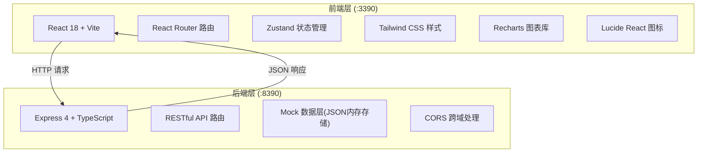
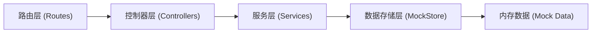
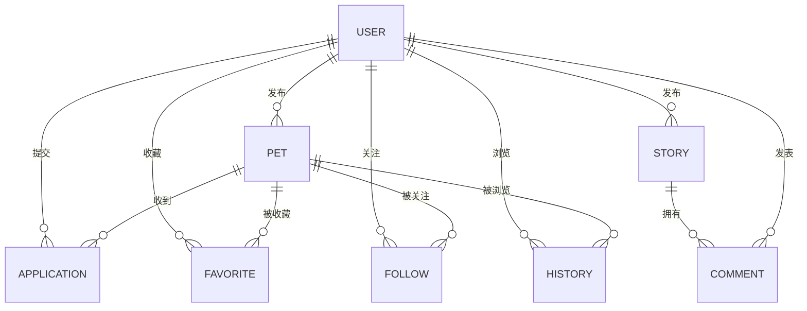

## 1. 架构设计



## 2. 技术描述
- 前端: React@18 + TypeScript + Vite@5 + React Router DOM@6 + TailwindCSS@3 + Zustand@4 + Recharts@2 + Lucide React
- 后端: Express@4 + TypeScript + CORS
- 数据存储: 内存 Mock 数据（预置 30 只宠物 + 5 条领养故事）
- 初始化工具: vite-init react-express-ts 模板

## 3. 路由定义
| 前端路由 | 用途 |
|---------|------|
| / | 首页（轮播、搜索筛选、瀑布流） |
| /pet/:id | 宠物详情页 |
| /publish | 发布宠物信息页 |
| /profile | 个人中心（默认收藏列表） |
| /profile/favorites | 收藏列表 |
| /profile/history | 浏览历史 |
| /profile/mypets | 我的发布 |
| /profile/applications | 我的申请 |
| /profile/stories | 我的故事 |
| /admin | 管理后台仪表盘 |
| /story/:id | 领养故事详情页 |
| /stories | 领养故事列表页 |
| /login | 模拟登录页 |

| 后端 API 路由 | 方法 | 用途 |
|--------------|------|------|
| /api/pets | GET | 获取宠物列表（支持筛选/排序/搜索） |
| /api/pets/:id | GET | 获取宠物详情 |
| /api/pets | POST | 发布新宠物 |
| /api/pets/:id | PUT | 更新宠物信息 |
| /api/pets/species | GET | 获取所有物种及数量 |
| /api/applications | GET | 获取领养申请列表 |
| /api/applications | POST | 提交领养申请 |
| /api/applications/:id | PUT | 更新申请状态（通过/拒绝） |
| /api/favorites | GET | 获取收藏列表 |
| /api/favorites | POST | 添加收藏 |
| /api/favorites/:petId | DELETE | 取消收藏 |
| /api/follows | GET | 获取关注列表 |
| /api/follows | POST | 关注宠物 |
| /api/follows/:petId | DELETE | 取消关注 |
| /api/history | GET | 获取浏览历史 |
| /api/history | POST | 添加浏览记录 |
| /api/stories | GET | 获取领养故事列表 |
| /api/stories/featured | GET | 获取精选故事（轮播用） |
| /api/stories/:id | GET | 获取故事详情 |
| /api/stories | POST | 发布领养故事 |
| /api/stories/:id/like | POST | 点赞故事 |
| /api/stories/:id/comments | GET | 获取故事评论 |
| /api/stories/:id/comments | POST | 发表评论 |
| /api/admin/stats | GET | 管理后台统计数据 |
| /api/user | GET | 获取当前用户信息（模拟登录） |
| /api/user/login | POST | 模拟登录 |

## 4. API 定义（TS 类型）

```typescript
// 共享类型定义

export type Species = 'cat' | 'dog' | 'rabbit' | 'bird' | 'other';
export type Gender = 'male' | 'female';
export type PersonalityTag = '亲人' | '独立' | '活泼' | '安静' | '粘人' | '高冷' | '聪明' | '贪吃' | '胆小' | '勇敢';
export type ApplicationStatus = 'pending' | 'approved' | 'rejected';
export type UserRole = 'user' | 'publisher' | 'admin';

export interface Pet {
  id: string;
  name: string;
  species: Species;
  breed: string;
  age: number; // 月龄
  gender: Gender;
  weight: number; // kg
  neutered: boolean;
  healthDescription: string;
  personalityTags: PersonalityTag[];
  photoUrls: string[];
  publisherId: string;
  publisherName: string;
  createdAt: string;
  viewCount: number;
  favoriteCount: number;
  isAdopted: boolean;
  adoptedAt?: string;
}

export interface Application {
  id: string;
  petId: string;
  petName: string;
  applicantId: string;
  applicantName: string;
  contact: string;
  livingEnvironment: string;
  hasPetExperience: boolean;
  dailyCompanionTime: string;
  familyMembers: string;
  status: ApplicationStatus;
  createdAt: string;
  reviewedAt?: string;
}

export interface User {
  id: string;
  name: string;
  avatar: string;
  role: UserRole;
}

export interface Story {
  id: string;
  title: string;
  content: string;
  images: string[];
  authorId: string;
  authorName: string;
  authorAvatar: string;
  petId?: string;
  petName?: string;
  likes: number;
  isFeatured: boolean;
  createdAt: string;
}

export interface Comment {
  id: string;
  storyId: string;
  userId: string;
  userName: string;
  userAvatar: string;
  content: string;
  createdAt: string;
}

export interface HistoryRecord {
  id: string;
  petId: string;
  petName: string;
  petPhoto: string;
  viewedAt: string;
}

export interface AdminStats {
  speciesDistribution: { species: Species; count: number }[];
  monthlyTrend: { month: string; newPets: number; adoptedPets: number }[];
  topBreeds: { breed: string; count: number }[];
  avgWaitDays: number;
  adoptionSuccessRate: number;
  totalPets: number;
  adoptedPets: number;
  pendingApplications: number;
}
```

## 5. 服务端架构



## 6. 数据模型

### 6.1 实体关系



### 6.2 预置数据说明
- 30 只宠物: 猫 10 只、狗 10 只、兔 3 只、鸟 4 只、其他 3 只，覆盖不同年龄、性别、品种、性格标签
- 5 条领养故事: 各物种均有涉及，包含图文内容、点赞、评论
- 模拟用户 5 个: 含普通用户、发布者、管理员角色
